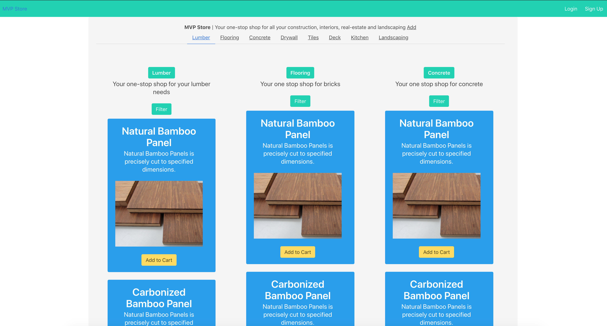

# MVP-Store

//------------------------------------------------------------------------------------------------------------------------

## Steps

==> npx create-react-app store

//------------------------------------------------------------------------------------------------------------------------
==> npm install bulma --save

npm install bulma --save
To add bulma to the project, we can reference Adding a CSS Preprocessor (Sass, Less etc.)

Edit the “scripts” section in package.json as follows:

"scripts": {
	"build-css": "node-sass-chokidar src/ -o src/",
	"watch-css": "npm run build-css && node-sass-chokidar src/ -o src/ --watch --recursive",
	"start-js": "react-scripts start",
	"start": "npm-run-all -p watch-css start-js",
	"build": "npm run build-css && react-scripts build",
	"test": "react-scripts test --env=jsdom",
	"eject": "react-scripts eject"
}
Then run the following commands

npm install --save-dev npm-run-all
npm install node-sass-chokidar --save-dev
npm start
//-------------------------------------------------------------------------------------------------------------------------
Follow steps outlined here : 

https://medium.com/@thejasonfile/basic-intro-to-react-router-v4-a08ae1ba5c42

npm install react-router --save

//-------------------------------------------------------------------------------------------------------------------------
### Dev
cd store
npm start

//-------------------------------------------------------------------------------------------------------------------------

### Prod
cd store
npm run build

The project was built assuming it is hosted at the server root.
You can control this with the homepage field in your package.json.
For example, add this to build it for GitHub Pages:

  "homepage" : "http://myname.github.io/myapp",

The build folder is ready to be deployed.
You may serve it with a static server:

  yarn global add serve
  serve -s build

git push
//-------------------------------------------------------------------------------------------------------------------------
